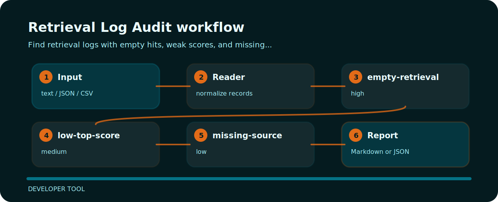

# Retrieval Log Audit


## What it protects

This repository turns a tiny plain text into reviewable signals for retrieval logging.

| Detail | Value |
| --- | --- |
| Area | developer tool |
| Entry | `retrieval-log-audit` |
| Input | plain text |
| Output | terminal findings, optional JSON |

## Inspection line



| Signal | Level | What it flags | Fix direction |
| --- | --- | --- | --- |
| `empty-retrieval` | high | retrieval returned no documents | Add coverage or route query to fallback handling. |
| `low-top-score` | medium | top retrieval score appears weak | Review chunking, query rewriting, or index freshness. |
| `missing-source` | low | source metadata is missing | Persist source URI or document identifier with each hit. |

## One-pass run

```bash
git clone https://github.com/mertefekurt/retrieval-log-audit.git
cd retrieval-log-audit
python -m pip install -e ".[dev]"
retrieval-log-audit examples/sample.txt
```
