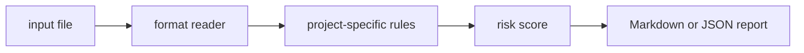

# retrieval-log-audit

`retrieval-log-audit` is a small local CLI that find retrieval logs with empty hits, weak scores, and missing source metadata.

## Why it is useful

RAG quality depends on retrieval logs that explain what happened. This CLI audits logs for empty or weak retrieval before answer quality is blamed on prompts.

## Key features

- reads text, JSON, JSONL, or CSV inputs
- returns Markdown or JSON reports
- supports severity-based CI exit codes
- keeps all checks deterministic and offline
- includes focused rules for this project:
- `empty-retrieval`: retrieval returned no documents
- `low-top-score`: top retrieval score appears weak
- `missing-source`: source metadata is missing

## Installation

```bash
python -m pip install -e ".[dev]"
```

## Usage

```bash
retrieval-log-audit examples/sample.txt
retrieval-log-audit examples/sample.txt --json
retrieval-log-audit path/to/input.txt --fail-on medium --out report.md
python -m retrieval_log_audit --help
```

Example input:

```text
query password reset hits: 0 top_score: 0.12 source: missing
```

## CLI options

```text
retrieval-log-audit INPUT [--format auto|text|jsonl|csv|json] [--json]
             [--fail-on low|medium|high] [--out PATH]
```

`INPUT` is any retrieval log JSONL, CSV, or notes. The tool exits with code `2` when findings meet the selected
threshold, which makes it easy to use in GitHub Actions or release checks.

## Workflow



## Tests

```bash
ruff check .
pytest
python -m retrieval_log_audit --help
```

## License

MIT
