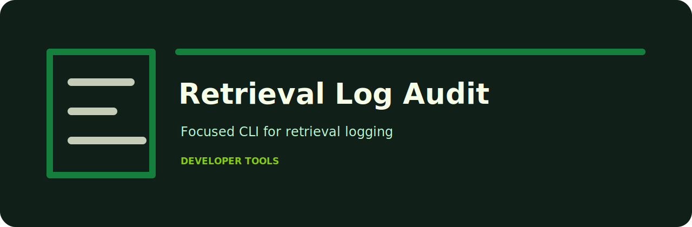

# Retrieval Log Audit

Find retrieval logs with empty hits, weak scores, and missing source metadata.

   

## Workflow

1. Collect the review notes or exported records.
2. Run `retrieval-log-audit` against the file.
3. Read the findings in Markdown, or switch to JSON for automation.
4. Fail CI only at the severity level you care about.

## Checks

| Rule | Severity | What it catches |
| --- | --- | --- |
| `empty-retrieval` | high | retrieval returned no documents |
| `low-top-score` | medium | top retrieval score appears weak |
| `missing-source` | low | source metadata is missing |

## Command line

```bash
python -m pip install -e ".[dev]"
retrieval-log-audit examples/sample.txt
retrieval-log-audit examples/sample.txt --json --fail-on medium
```

## Sample risky input

```text
examples/sample.txt
```

## Project shape

```text
.github/        CI workflow
examples/       sample inputs
src/            package source
tests/          test coverage
.gitignore      project file
pyproject.toml  package metadata
```
